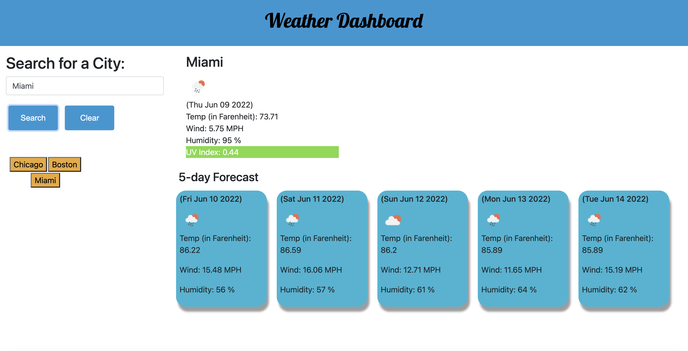

# Weather Dashboard

This application is a weather dashboard which shows the current weather and 5 day forecast of the city that the user chooses to search. After searching a city on the top left corner of the site, the current weather and five day forecast of the city searched will appear in the middle of the screen along with a list of previously searched cities by the user on the left side of the screen. This site was created using HTML, CSS, Bootstrap, Javascript, and many APIs including the OpenWeather API and Geocoding API. 

## Screenshot

## Deploy Link

[Deployed link](https://kishanshah98.github.io/Weather-Dashboard/)

